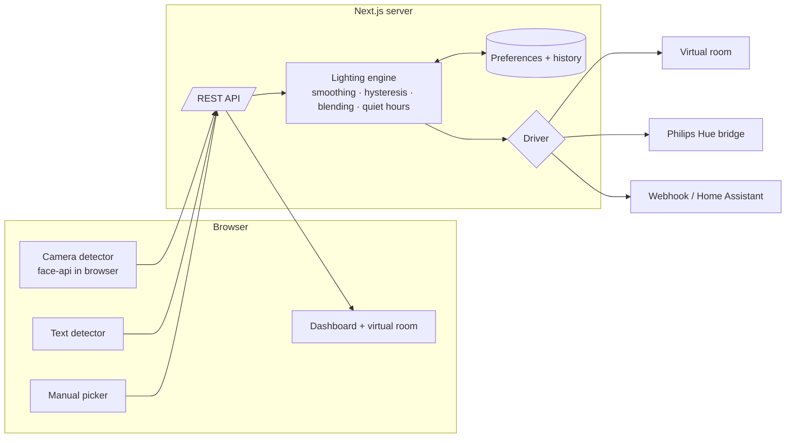

<p align="center">
  
</p>

<h1 align="center">Emotion-Responsive Smart Lighting System</h1>

<p align="center">
  Smart lighting that adapts illumination to the user's emotional state to create personalised, immersive environments.
</p>

<p align="center">
  <a href="https://github.com/ungaaaabungaaa/emotion-responsive-smart-lighting-system/actions/workflows/ci.yml"></a>
  
  
  
  
</p>

---

## What it does

The system continuously senses how the user feels and translates that into light: colour, brightness, colour temperature, transition speed and dynamic effects. It runs as a small Next.js app with a lighting engine on the server, a virtual room in the browser, and pluggable drivers for real hardware.

- **Three ways to sense emotion**
  - **Camera**: facial-expression recognition in the browser (face-api / TensorFlow.js). Video never leaves the device.
  - **Text**: a lexicon classifier for journaling, chat or voice transcripts. Works fully offline.
  - **Manual**: one tap to set the mood, or any external system can `POST /api/emotion`.
- **A lighting engine that feels natural, not twitchy**
  - Readings are placed on the valence/arousal *affect plane* and exponentially smoothed.
  - Hysteresis stops the lights from flickering when the detector wavers.
  - Neighbouring moods are blended, so the room drifts between scenes instead of snapping.
  - Low-confidence readings are ignored and the current scene is held.
- **Personalisation**
  - Global intensity, responsiveness, minimum confidence and switch delay.
  - Quiet hours with a brightness ceiling for late-night use.
  - Per-emotion scene overrides: rename a scene, change its hue and brightness.
- **Hardware drivers**
  - **Virtual room** (default): an animated CSS room for demos and development.
  - **Philips Hue**: local bridge API with proper CIE xy colour conversion.
  - **Webhook**: POSTs each light state as JSON to Home Assistant, Node-RED, an ESP32, or anything else.

<p align="center">
  
  <br />
  <em>An anxious reading dims the room to a lavender that breathes at six cycles per minute.</em>
</p>

## Emotion → lighting mapping

| Emotion   | Scene         | Colour           | Brightness | Temp   | Effect  | Why                                                        |
| --------- | ------------- | ---------------- | ---------- | ------ | ------- | ---------------------------------------------------------- |
| happy     | Sunrise Glow  | warm gold        | 90%        | 3200 K | none    | Warm light amplifies positive energy and sociability       |
| calm      | Lagoon        | soft teal        | 45%        | 2700 K | none    | Low brightness and cool-ish hue lower arousal              |
| focused   | Daylight Desk | neutral white    | 100%       | 5500 K | none    | Cool bright light improves alertness and concentration     |
| sad       | Hearth        | amber            | 55%        | 2400 K | candle  | Gentle warmth offers comfort without harshness             |
| angry     | Cool Down     | muted blue-green | 50%        | 3000 K | none    | Calming and avoids reinforcing agitation                   |
| anxious   | Slow Breath   | lavender         | 40%        | 2700 K | breathe | 6 breaths/min pacing guides relaxed breathing              |
| tired     | Ember         | deep orange      | 25%        | 2000 K | none    | Very warm, very dim light limits blue exposure             |
| surprised | Spark         | magenta          | 95%        | 4000 K | pulse   | A bright accent acknowledges the moment, then settles      |
| neutral   | Everyday      | warm white       | 70%        | 3500 K | none    | Balanced everyday light                                    |

Every mapping can be overridden per user from the Personalisation panel or via the preferences API.

## Architecture



```
src/
├── app/                  Next.js app router: dashboard page and API routes
│   └── api/{emotion,state,preferences,drivers}
├── components/           Room preview, emotion panel, inputs, preferences, drivers
├── hooks/                useLightingSystem (polls /api/state, sends commands)
└── lib/
    ├── emotion/          Emotion model (affect plane) and the text detector
    ├── lighting/
    │   ├── profiles.ts   Emotion → lighting mapping and per-user overrides
    │   ├── engine.ts     Smoothing, hysteresis, blending, quiet hours
    │   ├── color.ts      HSL/RGB/CIE-xy/mired conversions
    │   └── drivers/      simulator, hue, webhook
    └── server/system.ts  Wires engine and drivers; one instance per process
tests/                    Vitest suites for engine, profiles, detector and drivers
```

## Getting started

Requirements: Node.js 18.17 or newer.

```bash
npm install
npm run dev
```

Open http://localhost:3000. The virtual room works out of the box. Try the **Manual** tab, type a sentence in **Text**, or start the **Camera** (the face model is fetched from a CDN on first use).

### Connecting Philips Hue

1. Find your bridge IP at https://discovery.meethue.com/.
2. Press the link button on the bridge, then within 30 seconds run:
   ```bash
   curl -X POST http://<bridge-ip>/api -d '{"devicetype":"emotion-lighting#dev"}'
   ```
   The response contains your `username`.
3. Copy `.env.example` to `.env` and set:
   ```
   LIGHT_DRIVER=hue
   HUE_BRIDGE_HOST=<bridge-ip>
   HUE_USERNAME=<username>
   HUE_LIGHT_IDS=1,2      # optional, defaults to every light
   ```
4. Restart the server. You can also switch drivers at runtime from the **Light output** panel.

### Webhook output

Set `LIGHT_WEBHOOK_URL=https://your-endpoint`. Every state change is POSTed as:

```json
{
  "emotion": "calm",
  "scene": "Lagoon",
  "rgb": { "r": 57, "g": 172, "b": 198 },
  "hex": "#39acc6",
  "brightness": 0.45,
  "colorTemperature": 2700,
  "transitionMs": 4000,
  "effect": "none",
  "effectPeriodMs": 0,
  "updatedAt": 1790792871642
}
```

## API

| Method | Path               | Body                                                | Purpose                                      |
| ------ | ------------------ | --------------------------------------------------- | -------------------------------------------- |
| GET    | `/api/state`       |                                                     | Current light state, preferences, history    |
| POST   | `/api/emotion`     | `{ emotion, confidence?, source? }` or `{ text }`   | Submit a reading; returns the new state      |
| GET    | `/api/preferences` |                                                     | Current preferences                          |
| PUT    | `/api/preferences` | Partial preferences object                          | Update preferences and re-apply the lights   |
| GET    | `/api/drivers`     |                                                     | Available drivers and which one is active    |
| PUT    | `/api/drivers`     | `{ id: "simulator" \| "hue" \| "webhook" }`         | Switch the active driver                     |

Example from a wearable or another service:

```bash
curl -X POST http://localhost:3000/api/emotion \
  -H 'content-type: application/json' \
  -d '{"emotion":"focused","confidence":0.8,"source":"api"}'
```

## Development

```bash
npm run lint        # ESLint
npm run typecheck   # TypeScript
npm test            # Vitest
npm run build       # Production build
npm run check       # lint + typecheck + test
```

CI runs all of the above on every push and pull request.

## Privacy

Camera frames are processed in the browser and never uploaded. The server keeps only the last 200 emotion readings in memory and forgets them on restart.

## License

MIT
